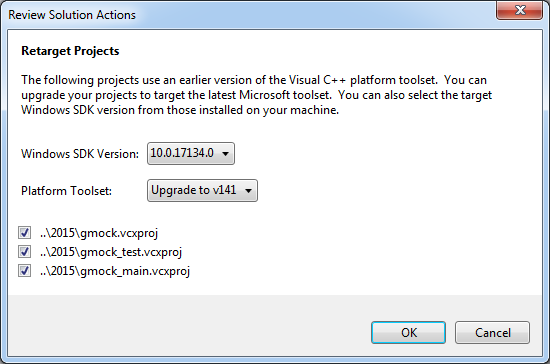
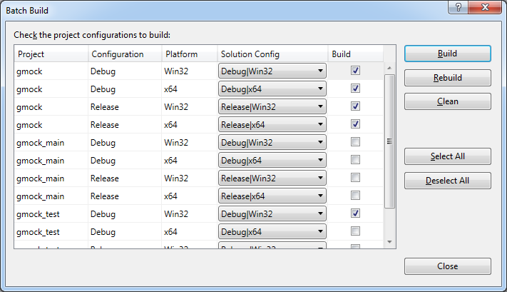

# Cloning, develpement and testing

## Simple usage:

None of steps described below are required to use the library.

Just: 
* [download](https://github.com/jbanaszczyk/ArduinoLibraries/archive/master.zip) and unpack archive
* copy required files into your project from `src` directory
* read the documentation

## Requirements

"My Arduino Libraries" are developed using "Visual Studio Community 2017" as Windows desktop application :)

## Clone

```
git clone git@github.com:jbanaszczyk/ArduinoLibraries.git
cd ArduinoLibraries
git submodule init
git submodule update --recursive --remote
```

## Build GoogleMock

* Navigate to `external\googletest\googlemock\msvc\2015`
* Open `gmock.sln`
* Allow  re-targeting 
* Build libraries and at least one test (building test takes some time). 
  * _menu:_ Build > Batch build > 
* Run the test:
  * select `gmock_test` project, 
  * _menu:_ Project > Set as StartUp Project, 
  * _menu:_ Debug > Start Without Debugging
